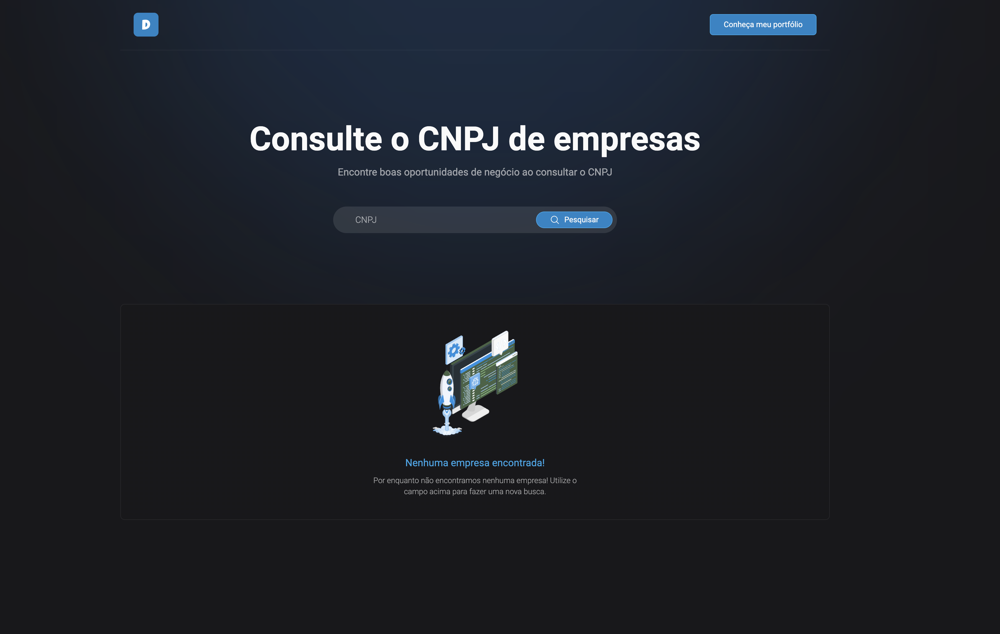

# Desafio Front-end

Criar uma tela de consulta de CNPJ que consuma a API da BrasilAPI e exiba as informações da empresa de maneira intuitiva responsiva e editável. 🚀 <br><br>



## 🚀 Tecnologias

- ✔️ Phosphor Icons - Lib de ícones
- ✔️ Tailwind CSS - Framework de utilitários CSS
- ✔️ LottieFiles - Recurso para customizar interações com svg

## 📦️ Pré-Requisitos

Antes de começar você vai precisar ter instalado na sua máquina a ferramenta [Git](https://git-scm.com/).

## ⚡ Executando o projeto em produção

1. Insira a url em seu navegador

```
    https://
```

## 🖥️ Executando o projeto em desenvolvimento
1. Clone o repositório
```
    git clone https://github.com/DouglasLacerdaC/desafio-front-end.git
```
2. Encontre o arquivo index.html na raiz do projeto
```
    index.html
```
3. Acesse o arquivo pelo navegador
```
    file:///Users/user/desafio-front-end/index.html
```

Desenvolvido por [Douglas Lacerda](https://www.linkedin.com/in/douglas-lacerda-da-conceicao/) 🤠
